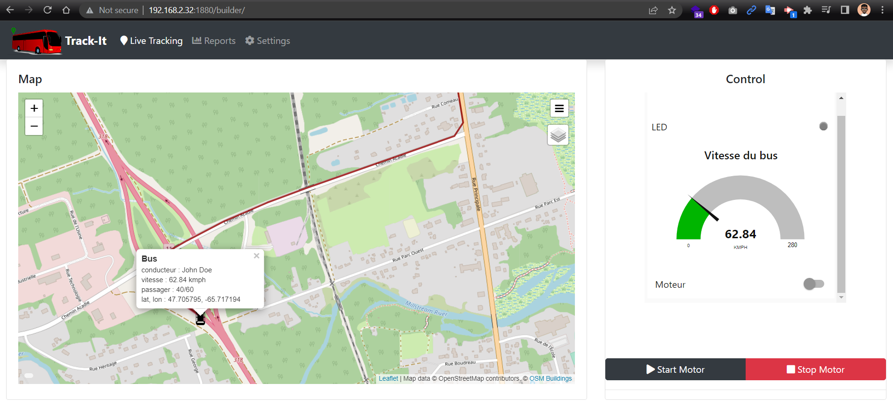
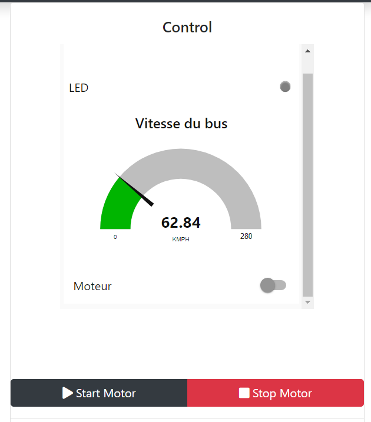
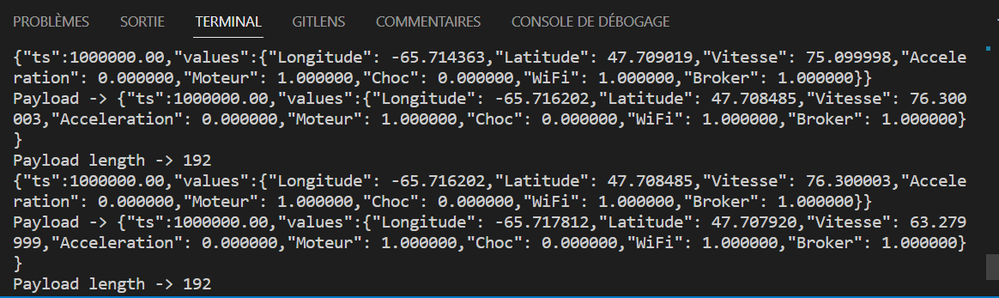
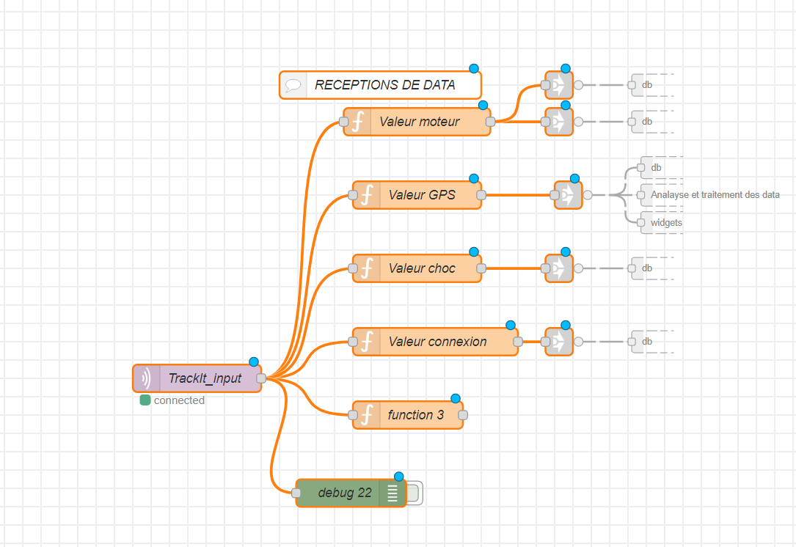
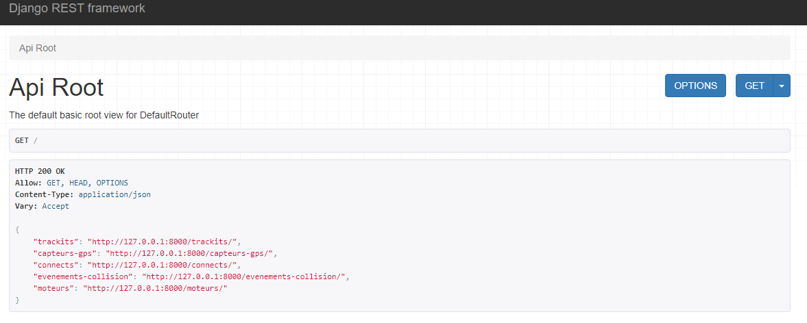
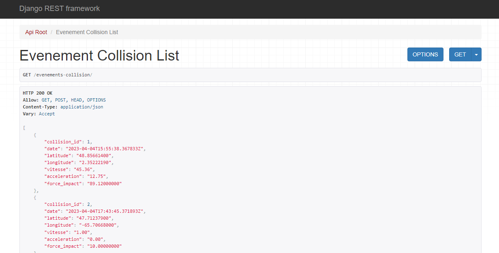
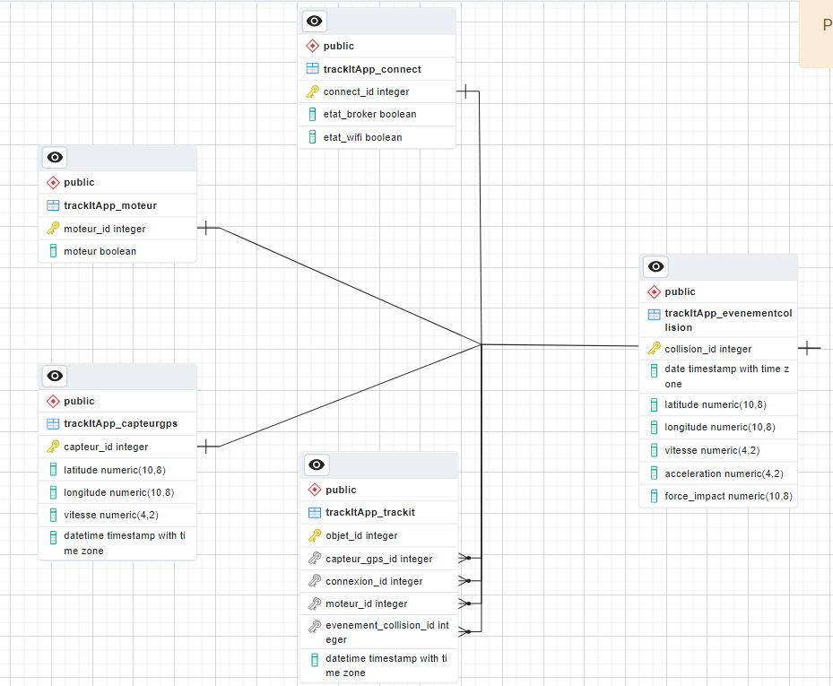
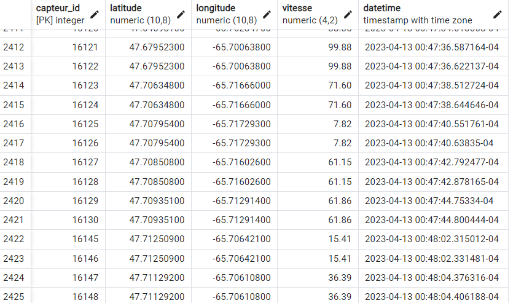
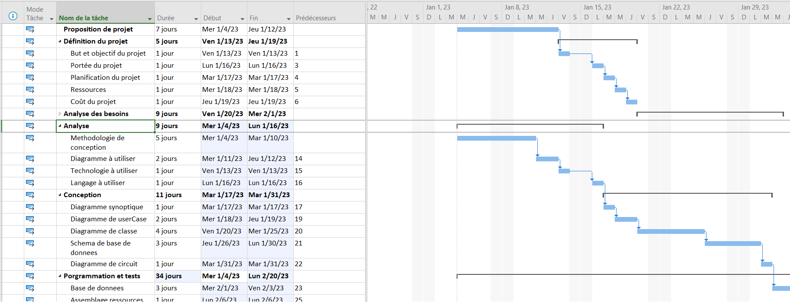

#TRACK-IT

Track-It est un projet IoT innovant qui vise à améliorer la sécurité routière en surveillant la vitesse des bus en temps réel, en les géolocalisant et en permettant l'arrêt à distance de leur moteur en cas de besoin.

Ce projet a été conçu pour répondre à un besoin urgent de contrôle de la vitesse, étant donné que 30% des accidents de la route sont causés par un excès de vitesse ay Cameroun selon ce rapport https://tinyurl.com/3vxxkhp2. En mettant en œuvre ce système de suivi, nous espérons réduire le nombre d'accidents et encourager les conducteurs à adopter une conduite plus responsable.

##Fonctionnalités :
    - Surveiller la vitesse des bus en temps réel 
    - Géolocaliser les bus en temps réel 
    - Permettre l'arrêt à distance du moteur des bus en cas de besoin 
    - Enregistrer les événements de collision et les alerter en temps réel 
    - Analyser les données de conduite pour améliorer la sécurité routière

##Connectivité :
    - Wifi uniquement
    - Création d'un point d'accès Wi-Fi : Track-It peut créer un point d'accès Wi-Fi pour configurer les paramètres de connexion au réseau Wi-Fi.
    - Stockage des informations de connexion : Les informations de connexion au réseau Wi-Fi sont stockées dans la mémoire de l'appareil pour être récupérées automatiquement lors du prochain démarrage.
    - Interface Web : Track-It fournit une interface Web simple pour configurer les paramètres de connexion au réseau Wi-Fi.
    - Détection automatique du réseau :  peut détecter automatiquement les réseaux Wi-Fi disponibles et les afficher dans l'interface Web pour faciliter la sélection du réseau.

##Securité :
    - Sécurité avec Mosquitto : authentification des clients avec username, password et client ID
    - Sécurité avec Node-RED : authentification des utilisateurs pour l'accès au système

##Technologies utilisées : 
    - Ubuntu Server sur Raspberry Pi 4 pour le système d'exploitation 
    - Django pour le développement de l'application web et la création de l'API 
    - PostgreSQL comme serveur de base de données 
    - MQTT pour les requêtes de communication device to cloud 
    - Node-red pour la gestion des flux -HTML, CSS, JavaScript et Bootstrap pour le développement du dashboard -Fritzing pour le montage du circuit électronique

En tant que responsable de la conception et de l'implémentation de tout le système, j'ai participé à la mise en place d'Ubuntu Server sur le Raspberry Pi 4, ainsi qu'au développement de l'application web avec Django et la création de la base de données avec l'ORM pour le backend. J'ai également travaillé sur la création de l'API pour l'exposition des ressources, ainsi que sur le développement du dashboard avec HTML, CSS, JavaScript et Bootstrap pour qu'il s'actualise chaque seconde.

Nous avons choisi PostgreSQL comme serveur de base de données pour ses performances et sa fiabilité. Nous avons également déployé le broker Mosquitto pour les requêtes MQTT et Node-red pour la gestion du flux, afin de garantir une communication efficace et rapide entre les différents composants du système.

Enfin, nous avons utilisé Fritzing pour le montage du circuit électronique, afin de garantir une intégration optimale entre le matériel et le logiciel.

Le projet Track-It utilise la bibliothèque WiFiManager pour permettre une configuration facile du Wi-Fi. Cette bibliothèque fournit une interface web permettant aux utilisateurs de se connecter facilement à un réseau Wi-Fi en entrant simplement le nom du réseau et le mot de passe. De plus, WiFiManager permet de stocker les informations de connexion Wi-Fi dans la mémoire de l'appareil pour une connexion automatique lors de l'allumage. 

##Équipe :
    - Yvan Tankeu  développeur Junior, responsable de projet.
    - Honvo Christophe  Enseignant IoT,

Nous sommes fiers de contribuer à la sécurité routière et espérons que notre projet sera utile pour réduire le nombre d'accidents de la route causés par un excès de vitesse.

##Control moteur et visualition vitesse bus

##Payload Json des données captées et envoyées au broker MQTT

##Flow traitement des données entrants

##API - End points disponible

##API - End point d'un event de collision

##Schema base de données

##Table données GPS

##Evolution projet
